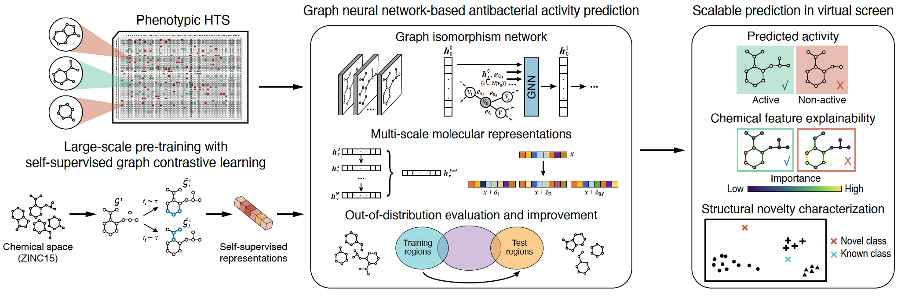

# GNEprop


GNEprop library associated with the manuscript: ["A high-throughput phenotypic screen combined with an ultra-large-scale deep learning-based virtual screening reveals novel scaffolds of antibacterial compounds"](https://www.biorxiv.org/content/10.1101/2024.09.11.612340v1) (updated version will be released soon).

**GNEprop is a graph neural network-based model to predict antibacterial activity from molecular structures in virtual screening settings.**

The GNEprop library is based on a GNN encoder (Graph Isomorphism Networks ([ref](https://openreview.net/forum?id=ryGs6iA5Km), [ref](https://openreview.net/forum?id=HJlWWJSFDH))) and
includes multiple features, primarily focused on improving out-of-distribution
generalization and performing downstream analyses. 
In addition to self-supervised graph contrastive learning and
semi-supervised learning, the library includes features such as multi-scale
representations, structural augmentations, multi-scale adversarial augmentations,
meta-learning-based fine-tuning, attention-based aggregation, integrated gradients
for explainability, etc. 

Additionally, the repository includes datasets associated with the manuscript (primarly, the **GNEtolC dataset**)
and pre-trained checkpoints.

We are currently finalizing the release of this repository and associated data/checkpoints, stay tuned for more updates.

## Getting Started

### Dependencies
The python environment is managed by `conda`. 
First, install Miniconda from https://conda.io/miniconda.html.

Then please use:
```
conda env create -f environment.yml --name gneprop
conda activate gneprop

git clone https://github.com/learnables/learn2learn/
cd learn2learn
pip install .
```


### Installing

No further installation is currently needed.


### Running GNEprop

#### Self-supervised graph contrastive pretraining 
* Refer to `clr.py` 

#### Supervised fine-tuning
* Refer to `gneprop_pyg.py` 

### Reproducing Manuscript Results

This section include pointers to reproduce the main manuscript results.

#### Hyperparameter search
Hyperparameter search can be run specifying the search space as a `.yaml` file. Default configuration is reported in `config/hparams_search.yaml`, and can be run with the following command:
```
python gneprop_pyg.py --dataset_path support_data/s1b.csv --gpus 1 --split_type scaffold --keep_all_checkpoints --max_epochs 30 --metric val_ap --num_workers 8 --log_directory <log_directory> --parallel_folds 20 --adv flag --adv_m 5 --hparams_search_conf_path config/hparams_search.yaml"
```

#### Supervised training (public dataset)
* GNEprop trained without using pretrained weights:
```
python gneprop_pyg.py --dataset_path support_data/s1b.csv --lr 4.9379e-05 --hidden_size 500 --depth 5 --num_readout_layers 1 --dropout 0.13 --lr_strategy warmup_cosine_step --aggr mean --gpus 1 --split_type scaffold --max_epochs 30 --metric val_ap --num_workers 3 --log_directory <log_directory> --parallel_folds 20
```
* GNEprop trained using pretrained weights:
```
python gneprop_pyg.py --dataset_path support_data/s1b.csv --lr 4.9379e-05 --hidden_size 500 --depth 5 --num_readout_layers 1 --dropout 0.13 --lr_strategy warmup_cosine_step --aggr mean --gpus 1 --split_type scaffold --max_epochs 30 --metric val_ap --num_workers 3 --log_directory <log_directory> --parallel_folds 20 --pretrain_path <pretrained_path> --mp_to_freeze 0 --freeze_ab_embeddings --freeze_batchnorm
```
* To also add molecular features computed with RDKit, add the argument:
```
--use_mol_features
```
* To use random splitting instead of scaffold splitting, use:
```
--split_type random
```

Pretrained models are also provided [here](./additional_pages/checkpoints.md).

#### Self-supervised pre-training
The self-supervised model (trained on ~120M molecules from ZINC15) has been made available (check "Data Availability" section).

The self-supervised model can also be re-trained using:
```
python clr.py --dataset_path data_path/zinc15_cell_screening_GNE_all_081320_normalized_unique.csv --gpus 1 --max_epoch 50 --lr 1e-03 --model_hidden_size 500 --model_depth 5 --batch_size 1024 --weight_decay 0. --exclude_bn_bias --num_workers 64 --project_output_dim 256
```

Different augmentations (structural and molecular, and also complex combinations) are made available in `augmentations.py`. In general, the best augmentation can be dataset-dependent (see for example [ref](https://arxiv.org/abs/2010.13902), [ref](https://www.nature.com/articles/s42256-022-00447-x), [ref](https://dl.acm.org/doi/10.1145/3447548.3467186) for more background).

#### Supervised training (HTS dataset)

These are the configurations used for models trained on the HTS data in the manuscript, replicated here for the released GNEtolC dataset.

* GNEprop training, scaffold splitting:
```
python gneprop_pyg.py --dataset_path support_data/GNEtolC.csv --lr 4.9379e-05 --hidden_size 500 --depth 5 --num_readout_layers 1 --dropout 0.13 --lr_strategy warmup_cosine_step --aggr mean --gpus 1 --split_type scaffold --keep_all_checkpoints --max_epochs 50 --metric val_ap --num_workers 8 --exclude_bn_bias --log_directory <log_directory> --parallel_folds 8 --pretrain_path <pretrained_path> --mp_to_freeze 0 --freeze_ab_embeddings --freeze_batchnorm --freeze_bias --ig_baseline_ratio 0.3 --adv flag --adv_m 5
```
* GNEprop training, scaffold-cluster splitting:
```
python gneprop_pyg.py --dataset_path support_data/GNEtolC.csv --lr 4.9379e-05 --hidden_size 500 --depth 5 --num_readout_layers 1 --dropout 0.13 --lr_strategy warmup_cosine_step --aggr mean --gpus 1 --keep_all_checkpoints --max_epochs 50 --metric val_ap --num_workers 8 --exclude_bn_bias --log_directory <log_directory> --parallel_folds 8 --pretrain_path <pretrained_path> --mp_to_freeze 0 --freeze_ab_embeddings --freeze_batchnorm --freeze_bias --ig_baseline_ratio 0.3 --adv flag --adv_m 5 --split_type index_predetermined --index_predetermined_file support_data/dataset_100k_v1.pkl
```

#### Chemical filters

Filters definitions are included in `chem_utils.py`.

#### UMAPs

Examples of UMAP computations are included in YYY.

#### Explainability

Refer to `explainability.py`, in particular `explain_graph` method. Remember to add `--ig_baseline_ratio` parameter to the model training to make it compatible with explainability computation.

#### Other utils

The file `utils.py` include other functions, for example `find_similar_mols_matrix` is used to compute MF-based similarity between two sets of molecules.

#### Novel MOA detection

Refer to `ood.py`, in particular function `neg_distance_to_clusters`.

### GNEprop model 

The GNEprop encoder/library include different features, primarily focused on improving out-of-distribution generalization/evaluation and downstream analyses. Not all of these features have been used for the final model in the manuscript.
These include:

- `augmentations.py` includes a collection of augmentations and support for complex multi-augmentations. These can be used both for self-supervised contrastive learning and supervised learning.
- Multi-scale representations with [Jumping Knowledge Networks](https://arxiv.org/abs/1806.03536).
- Adversarial data augmentations ([ref](https://arxiv.org/abs/1805.12018)) based on the [FLAG](https://openaccess.thecvf.com/content/CVPR2022/html/Kong_Robust_Optimization_As_Data_Augmentation_for_Large-Scale_Graphs_CVPR_2022_paper.html) framework. See `--adv` and `--adv_m` parameters.
- Meta-learning based fine-tuning ([ref](https://arxiv.org/abs/1710.03463)). See `--meta` and related parameters.
- Different readout aggregation schema, including `global_attention` and [Graph Multiset Pooling](https://arxiv.org/abs/2102.11533).
- Different functions to pre-process labels and weight them in different settings.

Refer to `gneprop_pyg.py` and `clr.py` for more details.


### Data Availability

Data are available: `https://drive.google.com/drive/folders/1g3wZFa0jxadElcayJR0euvCWTWymXZ1J?usp=sharing`

Data currently not available will be finalized in the next few weeks.

In particular:
* support_data:
    * Public dataset (Stokes et al., 2020): `s1b.csv` 
    * GNEtolC dataset: `GNEtolC.csv`
    * scaffold-cluster splitting for GNEtolC dataset: `dataset_100k_v1.pkl`
    * Known antibiotics for novel MOA detection analysis: `Extended_data_table_antibiotics.csv`
    * Dataset for self-supervised training: `zinc15_cell_screening_GNE_all_081320_normalized_unique.csv.tgz`
    * Virtual hits labeled with result label: `screening_hits.xlsx`
* checkpoints:
  * Refer to [page](./additional_pages/checkpoints.md).

**All associated data is licensed under a [Creative Commons Attribution-NonCommercial 4.0 International license](https://creativecommons.org/licenses/by-nc/4.0/)**.

### Hardware and CUDA Requirements

In general, it is possible to train small datasets (hundreds of molecules) in a few minutes
using CPU only. Training GNEprop on a CUDA-enabled GPU is recommended. 

Multiple GPUs can be used to speed up multi-folds training
(using arguments `--parallel_folds` and `--num_gpus_per_fold`) or to speed up a single training
with data parallelism (using argument `--gpus` from `pytorch_lightning`).

For self-supervised training on large datasets (e.g., 120M molecules as in the
manuscript) is recommended having multiple GPUs and CPUs available.

GNEprop relies on `cudatoolkit` and `cuDNN`.


## Help

Parameters:
```
python clr.py --help
python gneprop_pyg.py --help
```

## Authors

Refer to manuscript.

## Contact us

Reach out to Gabriele Scalia (scaliag@gene.com), Ziqing Lu (luz21@gene.com), or Tommaso Biancalani (biancalt@gene.com) for questions on the repository.


