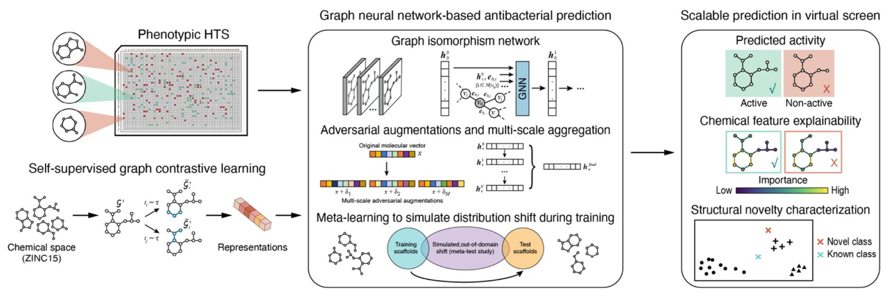

# GNEprop


GNEprop model associated with the manuscript: ["A high-throughput phenotypic screen combined with an ultra-large-scale deep learning-based virtual screening reveals novel scaffolds of antibacterial compounds"](https://www.biorxiv.org/content/10.1101/2024.09.11.612340v1) (updated version will be released soon).

**GNEprop is a graph neural network-based model to predict antibacterial activity from molecular structures in virtual screening settings.** GNEprop is based on a GNN encoder and includes multiple features, namely: self-supervised contrastive pre-training, multi-scale adversarial augmentations, meta-learning fine-tuning for out-of-distribution generalization (check manuscript for additional details).

We are currently finalizing the release of this repository, stay tuned for more updates.

## Getting Started

### Dependencies
The python environment is managed by `conda`. 
First, install Miniconda from https://conda.io/miniconda.html.

Then please use:
```
conda env create -f environment.yml --name gneprop
conda activate gneprop

git clone https://github.com/learnables/learn2learn/
cd learn2learn
pip install .
```


### Installing

No further installation is currently needed.


### Running GNEprop

GNEprop has two main entry points
* `clr.py` to run the model for self-supervised pretraining and representation learning
* `gneprop_pyg.py` to run the model for supervised training

### Reproducing Manuscript Results

#### Hyperparameter search
In the following, trainings are based on the best parameters as reported in the manuscript.

Hyperparameter search can be run specifying the search space as a `.yaml` file. Default configuration is reported in `config/hparams_search.yaml`, and can be run with the following command:
```
python gneprop_pyg.py --dataset_path support_data/s1b.csv --gpus 1 --split_type scaffold --keep_all_checkpoints --max_epochs 30 --metric val_ap --num_workers 8 --log_directory <log_directory> --parallel_folds 20 --adv flag --adv_m 5 --hparams_search_conf_path config/hparams_search.yaml"
```

#### Supervised training (public dataset)
* GNEprop trained without using pretrained weights:
```
python gneprop_pyg.py --dataset_path support_data/s1b.csv --lr 4.9379e-05 --hidden_size 500 --depth 5 --num_readout_layers 1 --dropout 0.13 --lr_strategy warmup_cosine_step --aggr mean --gpus 1 --split_type scaffold --max_epochs 30 --metric val_ap --num_workers 3 --log_directory <log_directory> --parallel_folds 20 --adv flag --adv_m 5
```
* GNEprop trained using pretrained weights:
```
python gneprop_pyg.py --dataset_path support_data/s1b.csv --lr 4.9379e-05 --hidden_size 500 --depth 5 --num_readout_layers 1 --dropout 0.13 --lr_strategy warmup_cosine_step --aggr mean --gpus 1 --split_type scaffold --max_epochs 30 --metric val_ap --num_workers 3 --log_directory <log_directory> --parallel_folds 20 --pretrain_path <pretrained_path> --mp_to_freeze 0 --freeze_ab_embeddings --freeze_batchnorm --adv flag --adv_m 5
```
* To also add molecular features computed with RDKit, add the argument:
```
--use_mol_features
```
* To use random splitting instead of scaffold splitting, use:
```
--split_type random
```

#### Supervised training (GNEtolC dataset)
* GNEprop training, scaffold splitting:
```
python gneprop_pyg.py --dataset_path support_data/GNEtolC.csv --lr 4.9379e-05 --hidden_size 500 --depth 5 --num_readout_layers 1 --dropout 0.13 --lr_strategy warmup_cosine_step --aggr mean --gpus 1 --split_type scaffold --keep_all_checkpoints --max_epochs 50 --metric val_ap --num_workers 8 --exclude_bn_bias --log_directory <log_directory> --parallel_folds 8 --pretrain_path <pretrained_path> --mp_to_freeze 0 --freeze_ab_embeddings --freeze_batchnorm --freeze_bias --ig_baseline_ratio 0.3 --adv flag --adv_m 5
```
* GNEprop training, scaffold-cluster splitting:
```
python gneprop_pyg.py --dataset_path support_data/GNEtolC.csv --lr 4.9379e-05 --hidden_size 500 --depth 5 --num_readout_layers 1 --dropout 0.13 --lr_strategy warmup_cosine_step --aggr mean --gpus 1 --keep_all_checkpoints --max_epochs 50 --metric val_ap --num_workers 8 --exclude_bn_bias --log_directory <log_directory> --parallel_folds 8 --pretrain_path <pretrained_path> --mp_to_freeze 0 --freeze_ab_embeddings --freeze_batchnorm --freeze_bias --ig_baseline_ratio 0.3 --adv flag --adv_m 5 --split_type index_predetermined --index_predetermined_file support_data/dataset_100k_v1.pkl
```


#### Self-supervised model
The self-supervised model (trained on ~120M molecules from ZINC15) has been made available (20210827-082422.zip) (check "Data Availability" section).

The self-supervised model can be re-trained using:
```
python clr.py --dataset_path data_path/zinc15_cell_screening_GNE_all_081320_normalized_unique.csv --gpus 1 --max_epoch 50 --lr 1e-03 --model_hidden_size 500 --model_depth 5 --batch_size 1024 --weight_decay 0. --exclude_bn_bias --num_workers 64 --project_output_dim 256
```

#### Meta-learning fine-tuning
The meta-learning fine-tuning can be trained using `--meta` parameter, for example:

```
python gneprop_pyg.py --dataset_path data_path/<dataset_file> --lr 4.9379e-05 --hidden_size 500 --depth 5 --num_readout_layers 1 --dropout 0.13 --lr_strategy warmup_cosine_step --aggr mean --gpus 1 --split_type scaffold --max_epochs 30 --metric val_ap --num_workers 8 --log_directory <log_directory> --parallel_folds 8 --mp_to_freeze 0 --freeze_ab_embeddings --freeze_batchnorm --adv flag --adv_m 5 --supervised_pretrain_path_folds <supervised_training_path_dir> --meta --keep_all_checkpoints --meta_test half_val --keep_last_checkpoint
```

#### Chemical filters

Filters definitions are included in `chem_utils.py`.

#### Other parameters

Refer to `gneprop_pyg.py` and `clr.py` for other parameters.

#### Explainability

Refer to `explainability.py`, in particular `explain_graph` method.

#### Novel MOA detection

Refer to `ood.py`.

### Data Availability

Data are available: `https://drive.google.com/drive/folders/1g3wZFa0jxadElcayJR0euvCWTWymXZ1J?usp=sharing`

In particular:
* support_data:
    * Public dataset (Stokes et al., 2020): `s1b.csv` 
    * GNEtolC dataset: `GNEtolC.csv`
    * scaffold-cluster splitting for GNEtolC dataset: `dataset_100k_v1.pkl`
    * Known antibiotics for novel MOA detection analysis: `Extended_data_table_antibiotics.csv`
    * Dataset for self-supervised training: `zinc15_cell_screening_GNE_all_081320_normalized_unique.csv.tgz`
    * Virtual hits labeled with result label: `screening_hits.xlsx`
* checkpoints:
    * `20240709-103356`: GNEprop training on GNEtolC dataset with scaffold splitting
    * `20240709-103508`: GNEprop training on GNEtolC dataset with scaffold-cluster splitting
* pretrained_weights:     
    * `20210827-082422`: self-supervised checkpoint

All associated data is licensed under a [Creative Commons Attribution-NonCommercial 4.0 International license](https://creativecommons.org/licenses/by-nc/4.0/).

### Hardware and CUDA Requirements

In general, it is possible to train small datasets (hundreds of molecules) in a few minutes
using CPU only. Training GNEprop on a CUDA-enabled GPU is recommended. 

Multiple GPUs can be used to speed up multi-folds training
(using arguments `--parallel_folds` and `--num_gpus_per_fold`) or to speed up a single training
with data parallelism (using argument `--gpus` from `pytorch_lightning`).

For self-supervised training on large datasets (e.g., 120M molecules as in the
manuscript) is recommended having multiple GPUs and CPUs available.

GNEprop relies on `cudatoolkit` and `cuDNN`.


## Help

Parameters:
```
python clr.py --help
python gneprop_pyg.py --help
```

## Authors

Refer to manuscript.

## Contact us

Reach out to Gabriele Scalia (scaliag@gene.com), Ziqing Lu (luz21@gene.com), or Tommaso Biancalani (biancalt@gene.com) for questions on the repository.


